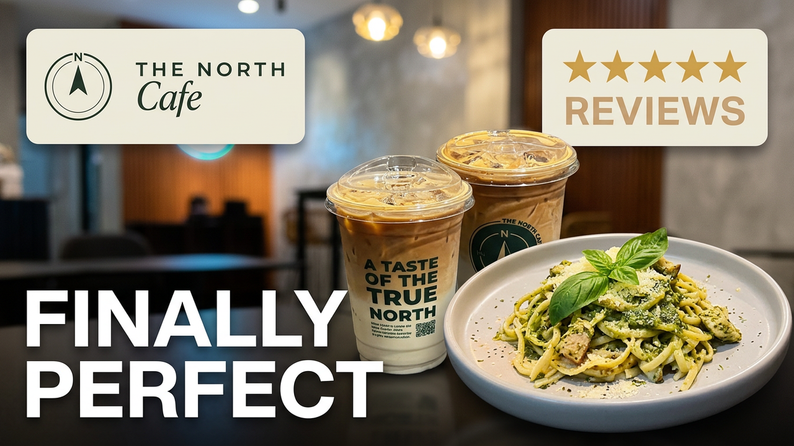

<div align="center">

# The North Cafe Website (DEMO)

### A taste of the true north.

*An editorial, production-grade website built from scratch for a real coffee shop in North Caloocan.*

<br>


<br>

[**🌐 Live Demo**](https://ranimelandagan.github.io/clientwebsite-demo-1/) &nbsp;·&nbsp; [**🎬 Video Walkthrough**](#-video-demo)

</div>

---

## 🧭 Overview

The North Cafe is a slow-coffee and honest-food spot in North Caloocan, and this is the website I built to match the feeling of the place: warm, unhurried, and quietly premium.

The whole thing is hand-coded with vanilla HTML, CSS, and JavaScript. No frameworks, no libraries, no build tools. Every animation, layout, and design decision is written from the ground up. I wanted to prove to myself that I could make something that looks like it came out of a design studio using nothing but the fundamentals done well.

---

## 🛠️ Tech Stack

| Layer | What I used |
|-------|-------------|
| **Markup** | Semantic HTML5 (accessible landmarks, ARIA labels, proper roles) |
| **Styling** | Modern CSS3: custom properties, Grid, Flexbox, `clamp()` fluid type, variable fonts |
| **Behavior** | Vanilla JavaScript (ES6+), no dependencies |
| **Typography** | Fraunces (variable display serif), Archivo, Manrope |
| **APIs / Browser** | IntersectionObserver, `document.fonts.ready`, `matchMedia` |
| **Integrations** | GrabFood ordering, Google Maps embed |
| **Hosting** | GitHub Pages & Netlify |

---

## ✨ Features

- **Cinematic hero intro** — the headline reveals line by line on load, timed to fire only once the fonts are ready so nothing flickers.
- **Scroll-triggered reveals** — sections and cards fade and rise into view with staggered timing using IntersectionObserver (not laggy scroll listeners).
- **Live menu filtering** — tap a category chip and the menu animates to filter pasta, sandwiches, sweets, or coffee.
- **3D logo tilt** — the brand seal subtly tilts toward your cursor on desktop, disabled automatically on touch devices.
- **Frosted-glass navigation** — the nav turns to a blurred, translucent bar once you scroll, and collapses into a full-height mobile drawer.
- **Fully responsive** — purpose-built layouts across five breakpoints, from ultrawide down to 360px phones.
- **Accessibility baked in** — keyboard navigation, an Escape-to-close menu, focus states, and a full `prefers-reduced-motion` fallback that disables animation for users who need it.
- **Real-world integrations** — direct GrabFood ordering links and an embedded, directions-ready Google Map.
- **Design details** — a film-grain texture overlay, an animated compass needle, and a color palette pulled directly from the cafe's real cups, menu, and interior.

---

## 🔨 The Process (How I Built It)

This is not the first website I've made, and honestly, the earlier ones taught me everything that made this one work.

My first few sites looked like what they were: tutorials stitched together. Generic fonts, flat colors, layouts that fell apart the moment you resized the window. They functioned, but they had no point of view. Looking back at them is what pushed me to actually learn design, not just code.

So this time I worked differently:

1. **I started with the brand, not the code.** Before writing a single line, I studied the cafe's real cups, menu, and interior photos and pulled the actual colors from them. That forest green, the cream, the mustard amber, all of it comes from the physical space.
2. **I built a design system first.** I set up CSS custom properties for color, typography, spacing, and motion before building any sections, so the whole site stays consistent and is trivial to retune.
3. **Structure before style.** I wrote clean, semantic, accessible HTML first and only then layered the visuals on top. That order keeps the markup meaningful instead of a pile of `div`s.
4. **Motion last, and with restraint.** Animation came at the end, on purpose. The goal was for it to feel intentional and calm, not busy.

The difference between this and my early work is not that I learned more CSS. It's that I learned to make decisions.

---

## 📚 What I Learned

The biggest lesson is simple and a little humbling: **if you want to make something great, it takes time.** The polish is not in the first version. It's in the tenth pass over the same hero section at 1am, nudging spacing and easing curves until it finally feels right.

Some of the more technical things this project drilled into me:

- **Design tokens change everything.** Once your colors, type scale, and spacing live in CSS variables, changing the entire mood of a site is a five-minute job instead of a five-hour one.
- **`clamp()` is the secret to fluid typography.** I stopped writing a dozen font-size media queries and let type scale smoothly between a min and max instead.
- **IntersectionObserver beats scroll listeners.** Watching elements enter the viewport this way is dramatically smoother than firing a function on every scroll event.
- **Variable fonts are underused.** Animating Fraunces' optical-size and softness axes gave the headings a character a static font just can't match.
- **Accessibility is not an add-on.** Building keyboard support and `prefers-reduced-motion` in from the start is far easier than retrofitting them, and it's the right thing to do.
- **Restraint is a skill.** Knowing which animation to cut is harder, and more valuable, than knowing how to add one.

---

## 🚀 How It Could Be Improved

I'd rather be honest about where this can go next than pretend it's finished:

- **A small CMS or headless backend** so the cafe can update menu items and prices themselves without touching code.
- **Optimized, responsive images** (WebP / AVIF with `srcset`) to cut load time, since the photography is currently the heaviest part of the page.
- **A real in-site ordering flow** instead of redirecting out to GrabFood.
- **Light/dark theming**, which the design-token setup already makes straightforward to add.
- **A Lighthouse and SEO pass** to push performance and discoverability scores higher.

---

## 💻 How to Run It

No build step, no dependencies. It's a static site, so:

```bash
# 1. Clone the repo
git clone https://github.com/ranimelandagan/clientwebsite-demo-1.git

# 2. Open the folder
cd clientwebsite-demo-1

# 3. Open index.html in your browser
```

That's it. For the best experience (and live reloading while editing), use the **Live Server** extension in VS Code instead of opening the file directly.

---

## 🎬 Video Demo

[](https://www.youtube.com/watch?v=NNgexcGnMFs)

---

<div align="center">

**Built by Ranimel B. Andagan**

Part builder, part finance nerd, full time entrepreneur!

[🌐 Live Site](https://ranimelandagan.github.io/clientwebsite-demo-1/) &nbsp;·&nbsp; [💼 LinkedIn](#) &nbsp;·&nbsp; [📍 North Caloocan, PH]

*N · 14.65°  ·  E · 120.97°*

</div>
